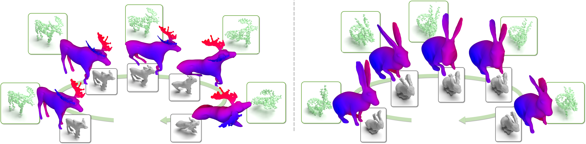
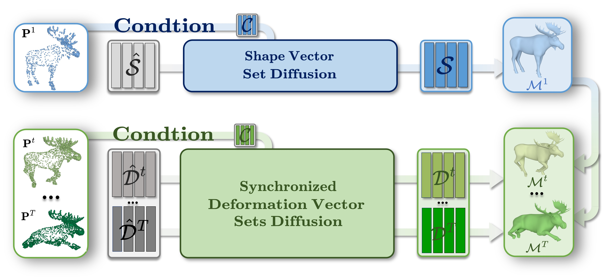
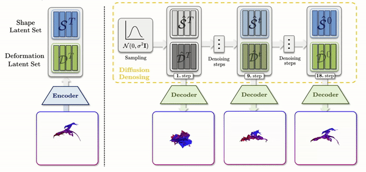

<div align="center">
<h2>🐎Motion2Vecsets: 4D Latent Vector Set Diffusion for Non-rigid Shape Reconstruction and Tracking</h2>

[**Wei Cao**](https://vveicao.github.io/)<sup>1*</sup> · [**Chang Luo**](https://github.com/netbeifeng)<sup>1*</sup> · [**Biao Zhang**](https://1zb.github.io/)<sup>2</sup> <br>
[**Matthias Nießner**](https://niessnerlab.org/members/matthias_niessner/profile.html)<sup>1</sup> · [**Jiapeng Tang**](https://tangjiapeng.github.io/)<sup>1</sup>

<sup>1</sup>Technical University of Munich  · <sup>2</sup>King Abdullah University of Science and Technology <br>
<sub>(* indicates equal contribution)</sub>

**CVPR 2024**

<a href="https://arxiv.org/abs/2401.06614"></a>
<a href="https://arxiv.org/pdf/2401.06614.pdf"></a>
<a href='https://vveicao.github.io/projects/Motion2VecSets/'></a>
<a href='https://www.youtube.com/watch?v=VXI3y2o0SqY&ab_channel=MatthiasNiessner'></a>
</div>

[\[Arxiv\]](https://arxiv.org/abs/2401.06614) [\[Paper\]](https://arxiv.org/pdf/2401.06614.pdf) [\[Project Page\]](https://vveicao.github.io/projects/Motion2VecSets/) [\[Video\]](https://www.youtube.com/watch?v=VXI3y2o0SqY&ab_channel=MatthiasNiessner) 


We present <b
              style="background: -webkit-linear-gradient(0deg, rgba(0,70,255,1) 0%, rgba(128,0,255,1) 50%, rgba(122,0,122,1) 100%); -webkit-background-clip: text; -webkit-text-fill-color: transparent;">Motion2VecSets</b>,
            a 4D diffusion model for dynamic surface reconstruction from sparse, noisy, or partial <b
              style="color: rgba(108, 198, 111, 1)">point cloud sequences</b>.
            Compared to the existing state-of-the-art method <b style="color: rgba(128, 128, 128, 1)">CaDeX</b>, our
            method can reconstruct more plausible non-rigid object surfaces with complicated structures and achieve more
            robust motion tracking.



<p>
    Given a sequence of sparse and noisy point clouds as inputs, labeled as <span style="font-weight: bold;">P<sup>t</sup></span> for t from 1 to T, Motion2VecSets outputs a continuous mesh sequence, labeled as <span style="font-weight: bold;">M<sup>t</sup></span> for t from 1 to T. The initial input frame, <span style="font-weight: bold;">P<sup>1</sup></span> (top left), is used as a condition in the <span style="color: #002060; font-weight: bold;">Shape Vector Set Diffusion</span>, which yields denoised shape codes, <span style="font-weight: bold;">S</span>, for reconstructing the geometry of the reference frame, <span style="font-weight: bold;">M<sup>1</sup></span> (top right). Concurrently, the subsequent input frames, <span style="font-weight: bold;">P<sup>t</sup></span> for t from 2 to T (bottom left), are utilized in the <span style="color: #385723; font-weight: bold;">Synchronized Deformation Vector Sets Diffusion</span> to produce denoised deformation codes, <span style="font-weight: bold;">D<sup>t</sup></span> for t from 2 to T, where each latent set, <span style="font-weight: bold;">D<sup>t</sup></span>, encodes the deformation from the reference frame, <span style="font-weight: bold;">M<sup>1</sup></span>, to each subsequent frame, <span style="font-weight: bold;">M<sup>t</sup></span>.
</p>



## Install

Install the environment following `scripts/init_environment.sh`, to install with cuda 11.0, use the command `bash scripts/init_environment.sh`

## Data preparation and Pretrained models

You can find the data preparation scripts in `/home/liang/m2v/dataset/dataset_generate` or you can directly download the [preprocessed dataset](https://nextcloud.in.tum.de/index.php/s/PQWBSJQaWyH6jxN).

For pretrained models, you can directly put them in the `ckpts` directory, and there are two subfolders `DFAUST` and `DT4D` for two datasets respectively, you can get them from the [Google Drive](https://drive.google.com/drive/folders/1Fg7glEYe4Dy4i5aezTP-MIuiNClzDuMc?usp=sharing).

## Training and evaluation

You can run the training with the following command, here we use the DFAUST dataset as an example. For DT4D dataset you may just change the path of config file.

```bash
# Shape
python core/run.py --config_path ./configs/DFAUST/train/dfaust_shape_ae.yaml # Shape AE
python core/run.py --config_path ./configs/DFAUST/train/dfaust_shape_diff_sparse.yaml # Diffusion Sparse Input
python core/run.py --config_path ./configs/DFAUST/train/dfaust_shape_diff_partial.yaml # Diffusion Partial Input

# Deformation
python core/run.py --config_path ./configs/DFAUST/train/dfaust_deform_ae.yaml # Deformation AE
python core/run.py --config_path ./configs/DFAUST/train/dfaust_deform_diff_sparse.yaml # Diffusion Sparse Input
python core/run.py --config_path ./configs/DFAUST/train/dfaust_deform_diff_partial.yaml # Diffusion Partial Input
```

For evaluation, you can run the following command:
```bash
python core/eval.py --config_path ./configs/DFAUST/eval/dfaust_eval_sparse.yaml # Test Sparse Unssen Sequence
python core/eval.py --config_path ./configs/DFAUST/eval/dfaust_eval_sparse.yaml --test_ui # Test Sparse Unssen Individual

python core/eval.py --config_path ./configs/DFAUST/eval/dfaust_eval_partial.yaml # Test Partial Unssen Sequence
python core/eval.py --config_path ./configs/DFAUST/eval/dfaust_eval_partial.yaml --test_ui # Test Partial Unssen Individual
```

## Demo

You can run `demo/infer.py` to get the predicted mesh sequence for the inputs located in `demo/inputs`, before running the demo, you need to download the [pretrained models](https://drive.google.com/drive/folders/1dvn-u2BCPkmRWH9wsDdxLOqTV8SzPb7i?usp=sharing) and put them in the `ckpts` directory.

## Citation
```
@inproceedings{Wei2024M2V,
    title={Motion2VecSets: 4D Latent Vector Set Diffusion for Non-rigid Shape Reconstruction and Tracking},
    author={Wei Cao and Chang Luo and Biao Zhang and Matthias Nießner and Jiapeng Tang},
    booktitle={Proceedings of the IEEE/CVF Conference on Computer Vision and Pattern Recognition},
    url={https://vveicao.github.io/projects/Motion2VecSets/},
    year={2024}
} 
```

## Reference
This project is based on several wonderful projects:
- 3DShape2Vecset: https://github.com/1zb/3DShape2VecSet
- CaDeX: https://github.com/JiahuiLei/CaDeX
- LPDC: https://github.com/Gorilla-Lab-SCUT/LPDC-Net
- Occupancy Flow: https://github.com/autonomousvision/occupancy_flow
- DeformingThings4D: https://github.com/rabbityl/DeformingThings4D
